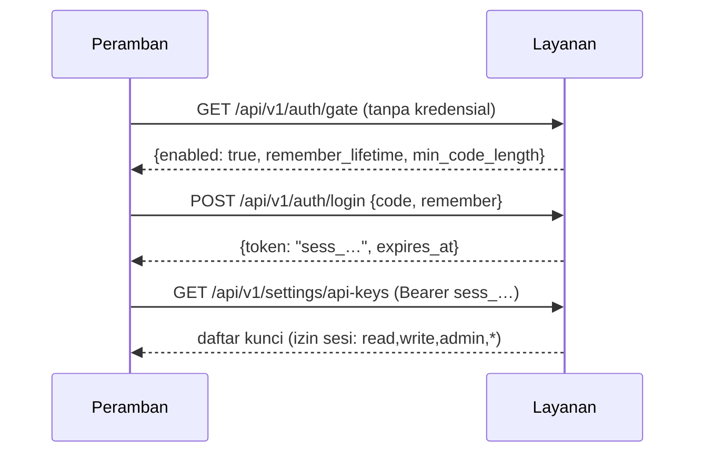

# Konsol, kode akses, dan sesi

Konsol di `/ui/` adalah satu halaman statis di peramban. Sebelum fitur ini, halaman itu harus
menempel **API key** ke kolom Koneksi untuk bisa memanggil layanan — dan pada pemasangan baru
belum ada kunci apa pun, sehingga menekan **Buat kunci** gagal dengan:

```
AUTH_INVALID: Missing credentials: send Authorization: Bearer <API key>
```

Pesan itu bukan bug di endpoint kunci, melainkan tanda konsol tidak punya kredensial untuk
dikirim. Jalan keluarnya: satu **kode akses** (passcode) yang ditukar menjadi **sesi**, sehingga
konsol bisa dipakai tanpa menempel apa pun.

---

## 1. Alur singkat

1. Buka `/ui/` → muncul satu isian **Kode akses** (dan pilihan *Ingat saya*).
2. Kode benar → layanan menerbitkan **token sesi** (`sess_…`) yang disimpan di peramban.
3. Token itu dikirim di header yang **sama** dengan API key:
   `Authorization: Bearer sess_…`. Semua endpoint lain tidak perlu tahu bedanya.
4. Sesi bertahan 12 jam (`UI_SESSION_HOURS`); dengan *Ingat saya* menjadi 7 hari
   (`UI_REMEMBER_DAYS`).
5. Kode akses dipasang/diganti di **Pengaturan → Akses & Sesi** (butuh izin `admin`).
6. Tombol **Keluar** di header mencabut sesi yang sedang dipakai.



---

## 2. Pemasangan pertama (kunci bootstrap)

Memasang kode akses butuh kredensial `admin`, sedangkan pemasangan baru belum punya kunci
sama sekali — kalau endpoint "pasang kode" dibuka untuk umum, pemanggil pertama akan mendapat
izin penuh. Karena itu layanan menerbitkan **satu kunci admin bootstrap** saat dijalankan, dan
hanya bila memang belum ada jalan masuk lain:

- dibuat bila `API_KEYS_JSON` **tidak** memuat izin `admin`/`*` **dan** registry masih kosong;
- nilainya ditulis ke `BOOTSTRAP_ADMIN_KEY_PATH` (bila kosong: **sebelah `API_KEYS_PATH`**, jadi
  ikut volume data — bawaan `data/bootstrap_admin_key.json`) dengan mode `0600`; nilainya
  **tidak** pernah masuk log, log hanya menampilkan jalur berkas + potongan tersamar;
- tampil di panel **Kunci API** seperti kunci lain, jadi bisa dicabut dari UI;
- setelah dicabut, menjalankan ulang layanan **tidak** menghidupkannya kembali.

Langkah operator satu kali:

```bash
# di server: lihat nama berkasnya (nilainya dipakai di langkah 2)
docker exec <container> cat /data/bootstrap_admin_key.json      # atau: cat data/bootstrap_admin_key.json
```

1. Tempel nilai `key` itu ke panel **Koneksi → API key layanan**, klik **Uji koneksi**.
2. Buka **Pengaturan → Akses & Sesi**, isi **Kode akses baru** (minimal 6 karakter) dua kali,
   klik **Simpan kode**. Kode lama tidak diperlukan karena pemanggilnya kunci, bukan sesi.
3. Klik **Keluar**, lalu masuk memakai kode akses tadi (centang *Ingat saya* bila perlu).
4. Kembali ke **Pengaturan → Kunci API**: cabut baris
   `kunci bootstrap (hapus setelah kode akses dipasang)`, lalu hapus berkas bootstrap di server.

Ingin melewati kunci bootstrap sepenuhnya? Setel `BOOTSTRAP_ADMIN_KEY=false` dan isi
`API_KEYS_JSON` dengan kunci `admin` Anda sendiri.

---

## 3. Yang disimpan di disk

| Berkas | Isi | Mode |
|---|---|---|
| `ACCESS_PATH` (`data/access.json`) | `digest` = SHA-256 kode + `hint` tersamar (`kod******11`), `set_at`, `updated_by` | 0600 |
| `SESSIONS_PATH` (`data/sessions.json`) | satu baris per sesi: `session_id`, `digest` (hash token), `hint`, `generation`, `remember`, `created_at`, `expires_at`, `last_used_at`, `revoked_at` | 0600 |
| `BOOTSTRAP_ADMIN_KEY_PATH` | kunci bootstrap (ditulis sekali) | 0600 |
| `API_KEYS_PATH` (`data/api_keys.json`) | registry kunci: SHA-256 kunci + hint, tanpa nilai penuh | 0600 |

Kode dan token **tidak pernah** bisa dibaca balik dari server — yang tersimpan hanya sidik
jarinya. `generation` (digest kode) juga tidak pernah dikirim ke klien: nilainya cukup untuk
menebak kode dari luar, jadi dipakai di server saja.

Sesi dicabut **dicatat, bukan dihapus** (`state: revoked`), sehingga jejaknya masih terbaca di
panel; berkasnya bisa dibersihkan manual bila sudah terlalu panjang.

---

## 4. Konfigurasi

| Env | Bawaan | Arti |
|---|---|---|
| `ACCESS_PATH` | `data/access.json` | lokasi berkas kode akses |
| `SESSIONS_PATH` | `data/sessions.json` | lokasi berkas sesi |
| `UI_SESSION_HOURS` | `12` | masa berlaku sesi tanpa *Ingat saya* |
| `UI_REMEMBER_DAYS` | `7` | masa berlaku sesi dengan *Ingat saya* |
| `UI_SESSION_ORGANIZATION_ID` | `default` | tenant yang dipakai sesi konsol |
| `UI_SESSION_USER_ID` | `operator` | `user_id` yang tercatat pada sesi |
| `UI_SESSION_APPLICATION_ID` | `rag-console` | `application_id` sesi |
| `UI_SESSION_PERMISSIONS` | `read,write,admin,*` | izin sesi konsol |
| `BOOTSTRAP_ADMIN_KEY` | `true` | terbitkan kunci admin pertama bila belum ada kunci |
| `BOOTSTRAP_ADMIN_KEY_PATH` | kosong → sebelah `API_KEYS_PATH` | lokasi berkas kunci bootstrap |

Kunci yang dibuat **dari sesi** memakai tenant sesi (`UI_SESSION_ORGANIZATION_ID`) — konsol
adalah alat operator untuk tenantnya sendiri. Membuat kunci untuk tenant lain tetap butuh
kredensial berizin `*` dan field `organization_id` diisi eksplisit.

---

## 5. Endpoint

| Metode | Jalur | Izin | Keterangan |
|---|---|---|---|
| `GET` | `/api/v1/auth/gate` | — | apakah konsol terkunci + masa berlaku sesi (tanpa kredensial) |
| `POST` | `/api/v1/auth/login` | — | tukar kode → token sesi (`remember` opsional) |
| `GET` | `/api/v1/auth/session` | kredensial | siapa yang sedang masuk (kunci/sesi) |
| `DELETE` | `/api/v1/auth/session` | sesi | keluar (mencabut sesi ini) |
| `POST` | `/api/v1/auth/logout` | sesi | sama, untuk klien yang hanya bisa POST |
| `GET` | `/api/v1/settings/access` | `admin` | status kode + daftar sesi aktif |
| `PUT` | `/api/v1/settings/access` | `admin` | pasang/ganti kode (dari sesi wajib menyertakan `current_code`) |
| `DELETE` | `/api/v1/settings/access` | `admin` | matikan kode; konsol kembali hanya lewat API key |
| `DELETE` | `/api/v1/settings/access/sessions` | `admin` | keluarkan semua sesi |
| `DELETE` | `/api/v1/settings/access/sessions/{id}` | `admin` | keluarkan satu sesi |

```bash
BASE=http://localhost:8000/api/v1
curl -s $BASE/auth/gate                                   # {"data":{"enabled":false,...}}

# pasang kode akses (butuh kunci admin)
curl -s -X PUT $BASE/settings/access -H "Authorization: Bearer $ADMIN" \
     -H 'Content-Type: application/json' -d '{"code":"kode-rahasia-saya"}'

# tukar kode jadi sesi, lalu pakai sesi itu seperti kunci
TOKEN=$(curl -s -X POST $BASE/auth/login -H 'Content-Type: application/json' \
        -d '{"code":"kode-rahasia-saya","remember":true}' | python -c 'import json,sys;print(json.load(sys.stdin)["data"]["token"])')
curl -s $BASE/knowledge -H "Authorization: Bearer $TOKEN"  # 200
```

Batas yang berlaku: percobaan kode salah dibatasi per alamat klien (`X-Forwarded-For` bila di
belakang proxy) dan jumlahnya diberitahukan di `details.attempts_left`; jumlah sesi aktif
dibatasi `MAX_ACTIVE_SESSIONS` (200); mengganti kode **langsung mematikan semua sesi lama**
karena setiap sesi terikat versi kode.

---

## 6. Lupa kode

Kode tidak bisa dibaca balik. Dua pilihan operator:

1. Pakai kunci API yang berizin `admin` untuk memasang kode baru lewat
   `PUT /api/v1/settings/access` (atau panel Akses & Sesi).
2. Matikan gerbang: hapus isi `ACCESS_PATH` (`{}`) atau `DELETE /settings/access`, lalu pasang
   kode baru. Layanan yang masih memakai kunci admin juga tetap bisa dipakai seperti biasa.

---

## 7. Kalau gerbang tidak muncul

| Gejala | Sebab paling sering | Tindakan |
|---|---|---|
| Halaman langsung terbuka tanpa kode | belum ada kode akses (`GET /auth/gate` → `enabled: false`) | pasang kode di panel Akses & Sesi |
| Gerbang muncul walau kode sudah benar | peramban menyimpan JS lama | muat ulang paksa; aset memakai cap versi `app.js?v=…` |
| `POST /auth/login` → `AUTH_INVALID` + `gate_enabled: false` | konsol tidak memakai kode akses | isi API key di panel Koneksi, atau pasang kode lebih dulu |
| `RATE_LIMITED` saat masuk | terlalu banyak percobaan dari alamat yang sama | tunggu sesuai `details.retry_after_seconds` |
| `403` + `details.field = current_code` | mengganti kode dari sesi tanpa kode lama | isi kolom **Kode akses sekarang** |
| Sesi hilang setelah ganti kode | perilaku yang disengaja | masuk lagi dengan kode baru |
