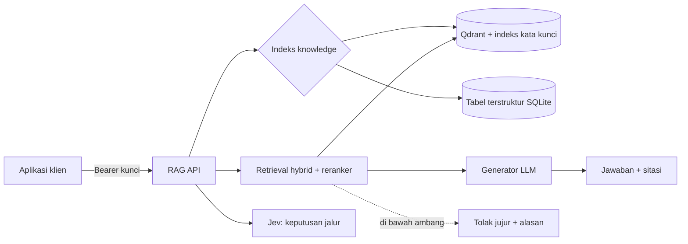

# RAG Service — Knowledge API multi-tenant

Layanan pengindeksan pengetahuan + retrieval hybrid + jawaban bersitasi, dengan **isolasi tenant keras**
dan **Jev** sebagai lapisan keputusan. Dokumentasi ini dipakai bersama oleh: operator, pengembang
aplikasi yang mengintegrasikan API, dan siapa pun yang perlu tahu bagaimana sistem ini bekerja.

!!! info "Tiga cara melihat dokumentasi ini"
    | Cara | Alamat | Isi |
    |---|---|---|
    | **Situs dokumentasi** (halaman ini) | `/guide/` | Panduan, integrasi, arsitektur, operasi |
    | **Swagger UI** (coba langsung dari browser) | `/docs` | Semua endpoint, skema request/response |
    | **Konsol chat** | `/ui/` | Unggah berkas, tanya, lihat sitasi |

    Ketiganya dilayani oleh layanan yang sama. Bila `DOCS_SITE_DIR` diisi dengan hasil `mkdocs build`,
    situs dokumentasi ikut tersaji — tidak perlu web server tambahan.

## Apa yang bisa dilakukan API ini

- **Mengindeks berkas** (28 format/38 ekstensi, termasuk `.doc`/`.xls`/`.ppt` lama) menjadi potongan teks
  beserta vektor + indeks kata kunci.
- **Menjawab pertanyaan** dengan retrieval hybrid (dense + BM25 → RRF → reranker) dan **sitasi bernomor**.
  Bila bukti tidak cukup, layanan **menolak menjawab** dan menyebut alasannya (`no_answer_reason`).
- **Menghitung angka dari spreadsheet** (xlsx/xls/ods/csv/tsv): total, rata-rata, jumlah, min/max, "paling laku".
  Angka **dihitung kode** dari baris nyata, bukan dikarang LLM.
- **Melayani banyak organisasi** dalam satu layanan: setiap permintaan membawa kunci API yang menentukan
  `organization_id` (tidak pernah dari body/prompt klien).

## Alur singkat

## Peta dokumentasi

| Halaman | Untuk siapa | Isi |
|---|---|---|
| [Mulai cepat](getting-started.md) | Semua | Menjalankan layanan & percobaan pertama dalam 5 menit |
| [Integrasi klien](integration.md) | Pengembang aplikasi | Autentikasi, contoh kode (cURL/Python/JS/PHP), kode error, pola retry |
| [Kontrak & alur API](api.md) | Pengembang | Kontrak lengkap: endpoint, envelope, arti setiap field |
| [Referensi API (dari OpenAPI)](api-reference.md) | Pengembang | Tabel endpoint & skema, otomatis dari `openapi.json` |
| [Swagger UI & OpenAPI](swagger.md) | Pengembang | Cara memakai `/docs`, mengimpor ke Postman, generate klien |
| [Arsitektur](architecture.md) | Teknis | Lapisan, modul, keputusan desain |
| [Pipeline RAG](rag-pipeline.md) | Teknis | Chunking, embedding, sparse, RRF, reranker, konteks |
| [Isolasi tenant](tenant-isolation.md) | Teknis/Keamanan | Dari mana `organization_id` datang & di mana difilter |
| [Deploy & menjalankan](deployment.md) | Operator | Profil sumber daya, systemd, nginx, backup, troubleshooting |
| [Verifikasi](verification.md) | Auditor | Bukti uji hidup: format berkas, tabel, anti-kehilangan data |
| [Evaluasi](evaluation.md) | Teknis | Pengukuran kualitas retrieval (Precision@5, refusal) |
| [Pakai ulang untuk aplikasi lain](reuse.md) | Pengembang | Menyalin perangkat dokumentasi ini ke proyek lain |

## Status apa adanya

- **263 test** (unit + integrasi) lulus; dijalankan ulang di setiap perubahan.
- Profil hemat RAM (tanpa model lokal) sudah dibuktikan hidup: pengindeksan, retrieval, jawaban bersitasi,
  analitik tabel, penghapusan dokumen.
- Yang **belum** ada / belum terbukti: streaming jawaban (SSE), OCR gambar, CI/CD, indeks vektor eksternal
  di luar satu proses, dan jalur Docker (berkasnya ada, belum pernah dijalankan di mesin pengembang).
  Daftar lengkap ada di [Verifikasi](verification.md) dan [Deploy](deployment.md).
